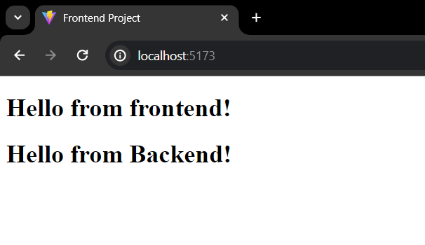

# Frontend - MERN Stack Template
## Description

This is the Frontend of the MERN Stack Template which is developed with react + vite. It runs on PORT 5173.

## Tech Stack

React.js + Vite, axios, jsdoc, better-docs

## How it looks



## Features

- Functions for fetching data using APIs from backend (src/lib)
- ESLint configure for preventing linting errors

## Available Scripts

Run development server.

```bash
npm run dev
```

Build the project.

```bash
npm run build
```

Run linting test on the code.

```bash
npm run lint
```

Generate static website for documentation using comments in the code.

```bash
npm run doc
```
